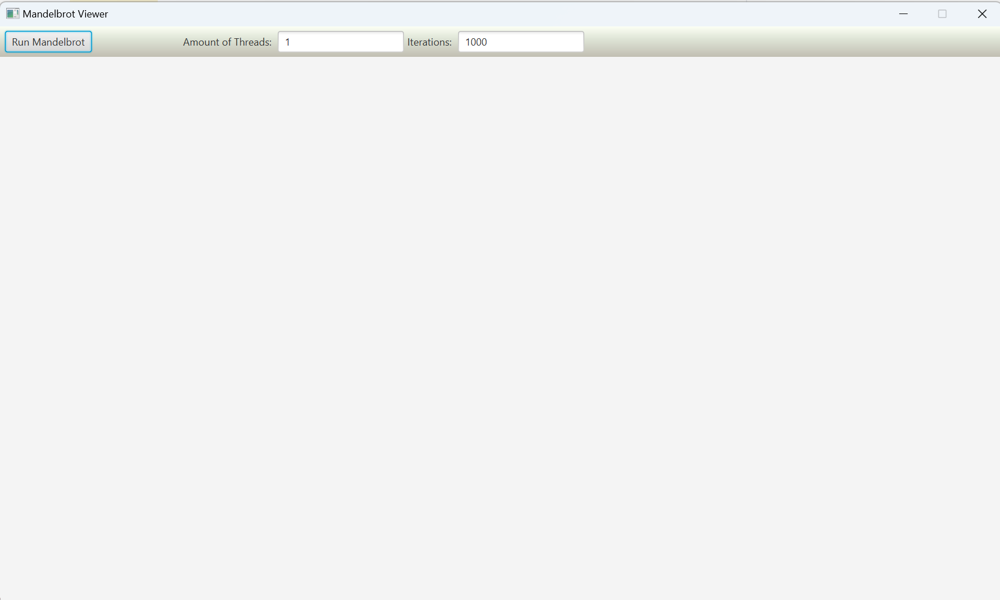
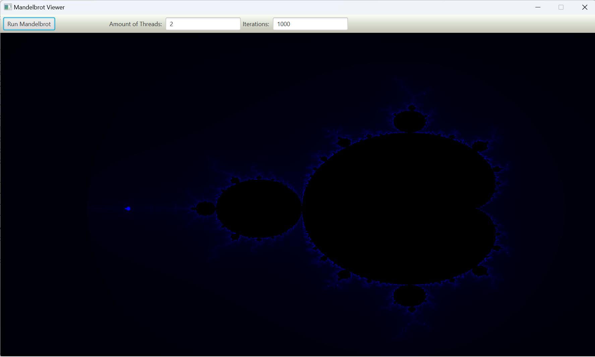

# Mandelbrot Visualizer

This project has been implemented as a semester project at the University of Neuchatel for the M. Sc. course "Concurrency: Multicore Programming and Data-Processing" by Maurice Amon.

## Instruction

The program allows the user to set the amount of threads that are going to be used manually, as well as the amount of iterations that are being conducted to decide
whether a complex number belongs to the Mandelbrot-set or not.

After we've configured our preferences, we can click on the "Run Mandelbrot"-button to start the parallel computation of the Mandelbrot set.

